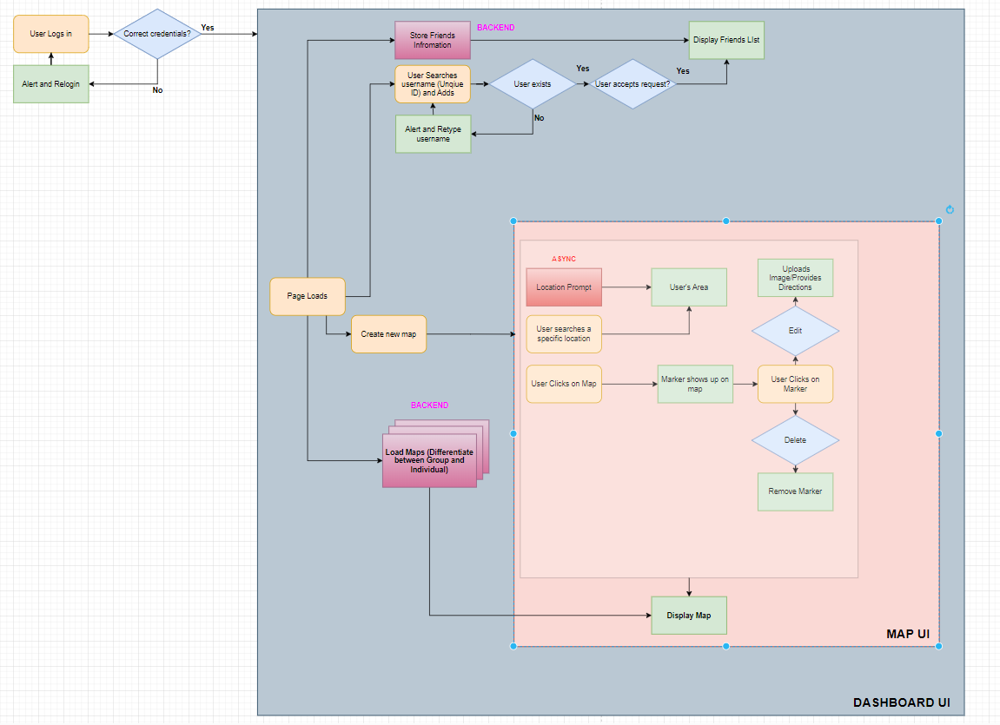

# LowkeyPlaces
The project aims to create a map for people to upload paths and locations of places less commonly known.

## Functionalities (* - Something we could add) 
1. **User Registration and Authentication:**
   - Allow users to create accounts and log in.
   - Implement secure authentication mechanisms to protect user data. 
2. **Profile Management:**
   - Enable users to create and manage their profiles (Location, Interests).
   - Include options for users to add profile pictures and personal information. *
3. **User Management :**
    - Allow users to "Follow/Add" other users as friends and create private groups to share their favourite locations
4. **User Interface :**
    - Include a map interface to drag, pinpoint, and mark the exact location.
          - Should be able to search for locations
          - Map area should be focused on the User's location by default
          - Menu Bar(s) with different options (Friends, Groups, Messages, Favourites)
    - Implement algorithms for directions or direct to Google Maps
5. **Activity Types:**
   - Define different types of leisure activities (e.g., playing a specific sport, biking, hiking).
   - Let users categorize their shared locations based on activity types. (Leisure, Business) *
6. **Social Features:**
   - Implement a news feed to show updates and activities from following users.
   - Location groups where only users who are in that area can join can be divided into (Province, City, Area) *
   - Chat System *
7. **Notifications:**
   - Send notifications to users for activities such as new location shares, comments on their locations, or friend requests.
8. **Rating and Reviews:**
   - Allow users to rate and review shared locations.
9. **Reporting and Moderation:**
    - Implement a reporting system for inappropriate content or behaviour.
    - Have a moderation system to review and take action on reported content.* 

# Project Structure
## Website Flowchart

## Website Demos
https://drive.google.com/drive/folders/1gS8rGF8E800ZelistKDFH2fldJ0onFzv?usp=drive_link

